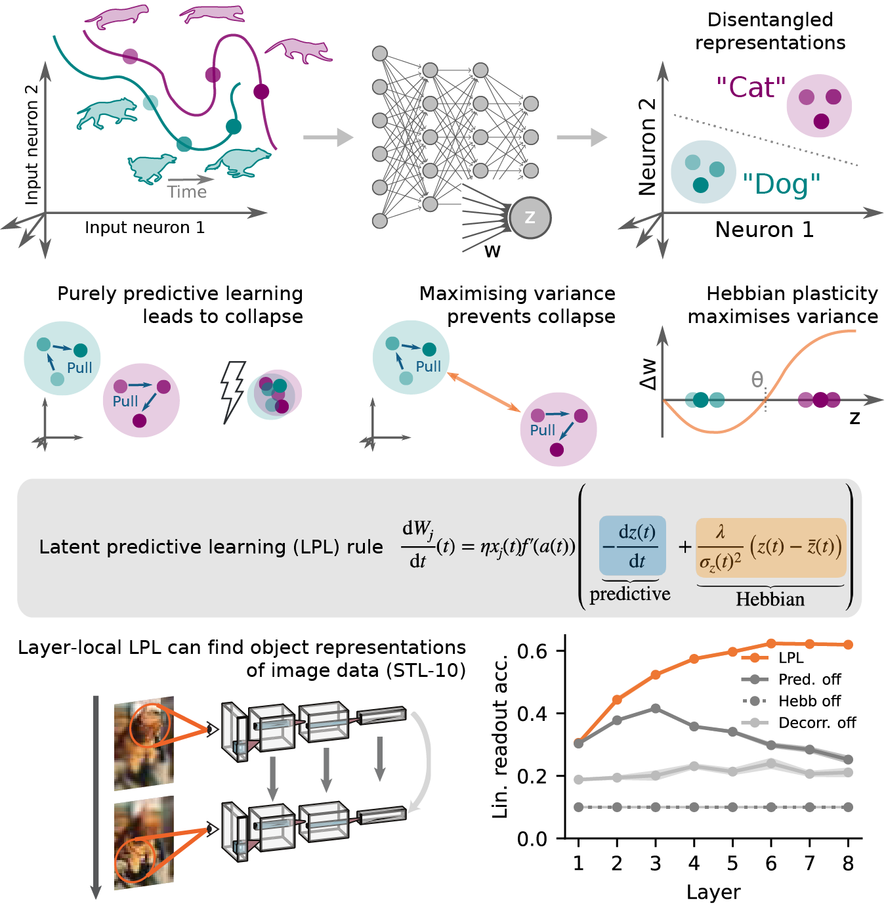

# Latent Predictive Learning



This repository contains code for reproducing results reported in our preprint on [LPL](https://www.nature.com/articles/s41593-023-01460-y), a framework for biologically plausible self-supervised learning.


**Erratum**: Despite careful checking, some errors and typos have made it into the published manuscript. 
We collect these errors [here](erratum/erratum.md).


## Setup

The deep learning simulations are based on the pytorch lightning framework. We've provided a requirements file to help you install everything you need by just running:
```
pip install -r requirements.txt
```

We recommend that you install these into a separate project-specific virtual environment.

For the spiking simulations, you'll need to install [Auryn](https://www.fzenke.net/auryn/doku.php).

## Usage

To train a deep net with layer-local LPL, simply run

```
python lpl_main.py
```

in the virtual environment you just created. Several useful command-line arguments are provided in `lpl_main.py` and `models/modules.py`. A few are listed below to assist you in playing around with the code on your own:
- `--train_with_supervision` trains the same network with supervision.
- `--use_negative_samples` trains the network with a cosine-distance-based contrastive loss. 
**Note:** this needs to be combined with setting the decorrelation loss coefficient to 0, and enabling the additional projection MLP.
- `--train_end_to_end` is a flag for training the network with backpropagation to optimize the specified loss (lpl, supervised or neg. samples) at the output layer only.
- `--no_pooling` optimizes the specified loss on the unpooled feature maps.
- `--use_projector_mlp` adds additional dense projection heads at every layer in the network where the loss is optimized.
- `--pull_coeff`, `--push_coeff`, and `--decorr_coeff` are the different loss coefficients. Default values are 1.0, 1.0, and 10.0 respectively.
- `--dataset` specifies the dataset to be used. The Shapes3D dataset needs a separate preprocessing step to make the required sequence of images (detailed in `notebooks/E5 - 3D shapes.ipynb`).
- `--gpus` is an integer that specifies the number of GPUs to use. If you have multiple GPUs, you can use this to speed up training or support larger datasets/batches by setting it to a number greater than 1, for example `--gpus 2` to use 2 GPUs.

By default, the code trains a VGG-11 network on the CIFAR-10 dataset with LPL. The default hyperparameters are the same as those used in the paper. The code will automatically download the dataset if it is not already present in the `~/data/datasets/` directory. Model performance and other metrics are logged under `~/data/lpl/$DATASET/`, where `$DATASET` is the name of the dataset used. You can monitor training progress by running `tensorboard --logdir ~/data/lpl/$DATASET/` in a separate terminal window.

### Note on network architectures
Only a VGG-11 architecture has been extensively tested, but the framework easily extends to other architectures. You can simply configure another encoder in `models/encoders.py`, and add it to `models/network.py`. In principle, everything should work with residual architectures (provided as an option) as well, but layer-local learning in this case is not well-defined because of the non-plastic skip connections. 

## Analysis and reproduction of figures

Jupyter notebooks under `notebooks` contain instructions on extracting and visualizing several metrics for the quality of learned representations. Also provided in the notebooks is the code for generating figures from the paper.

## Spiking network code

You find the spiking network code and instructions for reproducing the corresponding results under `spiking_simulations/`.

## Citation

```
@article{halvagal_combination_2023,
    title = {The combination of {Hebbian} and predictive plasticity learns invariant object representations in deep sensory networks},
    author = {Halvagal, Manu Srinath and Zenke, Friedemann},
    year = {2023},
    journal = {Nature Neuroscience},
    volume = {26},
    number = {11},
    pages = {1906--1915},
    issn = {1546-1726},
    url = {https://www.nature.com/articles/s41593-023-01460-y},
    doi = {10.1038/s41593-023-01460-y},
}
```
