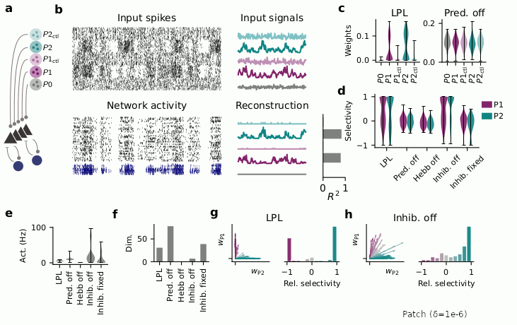
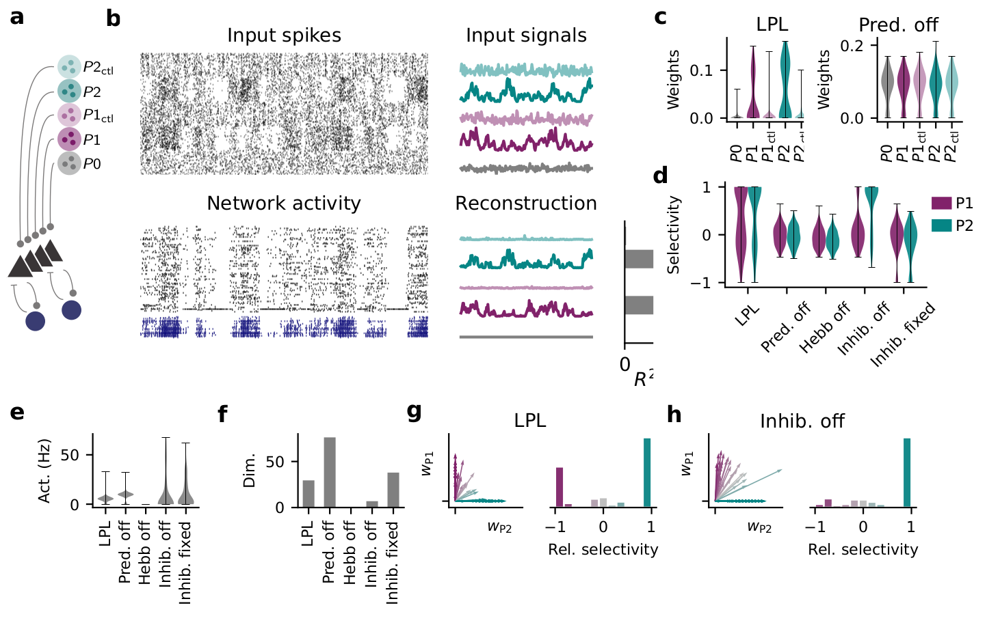
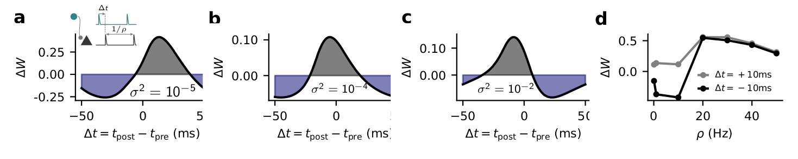

# Erratum

Here we keep track of typos and errors that have been reported to us by the attentive readers of our article:

> Halvagal, Manu Srinath, and Friedemann Zenke. 2023. ‘The Combination of Hebbian and Predictive Plasticity Learns Invariant Object Representations in Deep Sensory Networks’. Nature Neuroscience, October, 1–10. [https://doi.org/10.1038/s41593-023-01460-y](https://doi.org/10.1038/s41593-023-01460-y).

Thanks for reporting these problems. Our sincerest apologies that they made it into the final manuscript.

## Deep Learning Simulations

### Mathematical expression for the decorrelation loss

Thanks to Roy Urbach for pointing out a discrepancy between our simulation code underlying the decorrelation loss and the corresponding mathematical expression in the Methods section.
The mistake happened when transcribing our simulation code into equations. 
It does neither affect the results nor the study's conclusions.
In the article, we introduced the decorrelation loss as "the sum of the squared off-diagonal terms of the covariance matrix between units" given
by Eq. (6):

$$\mathcal{L}\_\mathrm{decorr}(t) = \frac{1}{(B-1)(M^2-M)}\sum_{b=1}^B\sum_{i=1}^M\sum_{k\neq i} (z_i^b(t)-\bar{z}\_i(t))^2(z_k^b(t)-\bar{z}\_k(t))^2 \quad ,$$

which is incorrect. The correct expression is:

$$\mathcal{L}\_\mathrm{decorr}(t) = \frac{1}{(M^2-M)}\sum_{i=1}^{M}\sum_{k\neq i}\left( \frac{\sum_{b=1}^B\left(z_i^b(t)-\bar{z}\_i(t) \right) \left(z_k^b(t)-\bar{z}\_k(t) \right)}{B-1}  \right)^2 \quad .$$

Consequently, the learning rule in Eq. (7) and Eqs. (3) and (4) in the Supplementary Material derived from the erroneous expression are also affected. 
The corrected expressions for the learning rules are:

$$\Delta W_{ij} = \eta\frac{1}{MB}\sum_{b=1}^B \biggl( -(z_i^b - z_i^b(t-\Delta t)) + \lambda_1\frac{\alpha}{\sigma_{i}^2}(z_i^b - \bar{z}\_i) - \lambda_2\beta \sum_{k\neq i} (z_k^b - \bar{z}\_k)C_{ik} \biggr) f'(a_i^b)x_j^b - \eta \eta_w W_{ij}$$

and

$$ \frac{\partial \mathcal{L}\_{\mathrm{decorr}}}{\partial W_{ij}} = \frac{4}{(B-1)(M^2-M)} \sum_{b=1}^B f'(a_i^b)x_j^b \sum_{k\neq i}\left(z_k^b(t)-\bar{z}\_k(t)\right)  C_{ik} \quad ,$$

where $C_{ik}$ is the covariance between units $i$ and $k$:

$$C_{ik} = \frac{1}{B-1}\sum_{b=1}^B \left(z_i^b(t)-\bar{z}\_i(t)\right)\left(z_k^b(t)-\bar{z}\_k(t)\right).$$

We apologize for any confusion caused by this oversight.

## Spiking Network Simulations

Thanks to Github user [yilun-wu](https://github.com/yilun-wu), who made us aware of a few small discrepancies between our simulation code and its description in the methods (Issues [#2](https://github.com/fmi-basel/latent-predictive-learning/issues/2), [#3](https://github.com/fmi-basel/latent-predictive-learning/issues/3), [#4](https://github.com/fmi-basel/latent-predictive-learning/issues/4), and [#5](https://github.com/fmi-basel/latent-predictive-learning/issues/5)).

### Implementation of transmitter triggered plasticity ([Issue #2](https://github.com/fmi-basel/latent-predictive-learning/issues/2))

First, there is a small mismatch between our spiking learning rule simulation and the rule reported in the Methods Eq. (18).
The learning rule we simulated was the following and that's what Eq. (18) should have read:
$$\frac{\mathrm{d}w_{ij}}{\mathrm{d}t} = \eta~\alpha \ast \left( \epsilon \ast S_j(t) f^\prime(U_i(t)) \right) \left[ \alpha \ast \left( -\left( S_i(t) - S_i(t-\Delta t))\right) + \frac{\lambda}{\sigma_i^2 + \xi} \left( S_i(t) - \bar S_i(t) \right) + \delta  \right) \right]$$
whereas we wrote:
$$\frac{\mathrm{d}w_{ij}}{\mathrm{d}t} = \eta~\alpha \ast \left( \epsilon \ast S_j(t) f^\prime(U_i(t)) \right) \left[ \alpha \ast \left( -\left( S_i(t) - S_i(t-\Delta t))\right) + \frac{\lambda}{\sigma_i^2 + \xi} \left( S_i(t) - \bar S_i(t) \right) \right) \right] + \eta \delta S_j(t)$$

Importantly, the plasticity rule we simulated corresponds to an alternative implementation of transmitter-triggered plasticity, which **does not** affect the results, which remain qualitatively unchanged. 
This qualitative resemblance can be seen in the following animated GIF comparing Figure 5 as published and three versions in which we [patched](patches/alternative_transmitter_triggered.patch) the code and simulated Eq. (18) as reported in the methods for varying values of $\delta$.

### Implementation of double exponential filtering for synaptic traces ([Issue #3](https://github.com/fmi-basel/latent-predictive-learning/issues/3))

There is another mismatch between code as simulated and the methods which affects the effective learning rate of the spiking rule.
Specifically, the double exponential filtering with $\epsilon$ as well as with the $\alpha$ kernel on the left in Eq. (18) above was implemented as follows:
$$\frac{\mathrm{d}\bar c}{dt}(t) = -\frac{\bar c(t)}{\tau^\mathrm{rise}} + c(t)$$

$$ \tau^\mathrm{fall} \frac{\mathrm{d} \bar{\bar{c}}}{\mathrm{d}t}(t) = -\bar{\bar{c}}(t) + \bar c(t) $$

in contrast to what we stated in the methods, which was

$$\tau^\mathrm{rise} \frac{\mathrm{d}\bar c}{dt}(t) = -\bar c(t) + c(t)$$

$$\tau^\mathrm{fall} \frac{\mathrm{d} \bar{\bar{c}}}{\mathrm{d}t}(t) = -\bar{\bar{c}}(t) + \bar c(t)$$

The rhs convolution with $\alpha$ was implemented as stated.
Since all filters are implemented through linear ODEs, the difference in implementation corresponds to an amplitude change of the filtered quantity while the shape remains unaffected. 
Thus the change corresponds to a change of learning rate by a factor of $\tau_\mathrm{rise}$. Hence the effective learning rate was by this factor _lower_ in our simulations than the methods suggest. 
Apologies for these inconsistencies. 

### Erroneous $\sigma^2$ trace normalization ([Issue #4](https://github.com/fmi-basel/latent-predictive-learning/issues/4))

Due to a missing multiplication with the simulation time step (1e-4s), the $\sigma^2$ trace was not properly normalized in our simulations. However, we can absorb this as a unit in the $\lambda$ parameter. Thus, when reproducing our simulation with the *correct* normalization, $\lambda$ has to be understood in units of $\times 10^{-4}$. This unit change also affects $\xi$'s value in Eq. (18).  

We verified that our simulation results are robust to this reparametrization. Below you see the plots for a [patched](patches/20240115-reparametrization.patch) simulation (commit `94daa6dac0d`) with $\lambda=1 \times 10^{-4}$, $\xi=10^{-7}$, including the patched transmitter triggered plasticity with $\delta=1 \times 10^{-3}$ (cf Issue #2 above). The qualitative results are the same, if not cleaner, due to the changes in transmitter-triggered plasticity.

### Implementation of relative refractory period ([Issue #5](https://github.com/fmi-basel/latent-predictive-learning/issues/5))

In the implementation of the absolute and relative refractory period of our spiking neuron model, the moving threshold is set to 50mV after every spike before being exponentially decayed down to the resting threshold value of -50mV instead of jumping by 100mV as stated in the paper (cf. Eq. (16)). Thus threshold effects do not accumulate, but are reset with every spike. However, this difference only has a minor effect at *very* high firing rates to the model and thus unlikely to affect the results.

### Implementation of inhibitory plasticity

There is a sign error in Eq. (24) in the article. 
We simulated   

$$\frac{dw_{ij}^\mathrm{inh}}{dt} = \zeta \left( ( x_i(t) - 2\kappa\tau^\mathrm{stdp} ) S_j(t) + (x_j(t) S_i(t) ) \right)$$

and not 

$$\frac{dw_{ij}^\mathrm{inh}}{dt} = \zeta \left( ( x_i(t) + 2\kappa\tau^\mathrm{stdp} ) S_j(t) + (x_j(t) S_i(t) ) \right)$$

as stated in the article.
